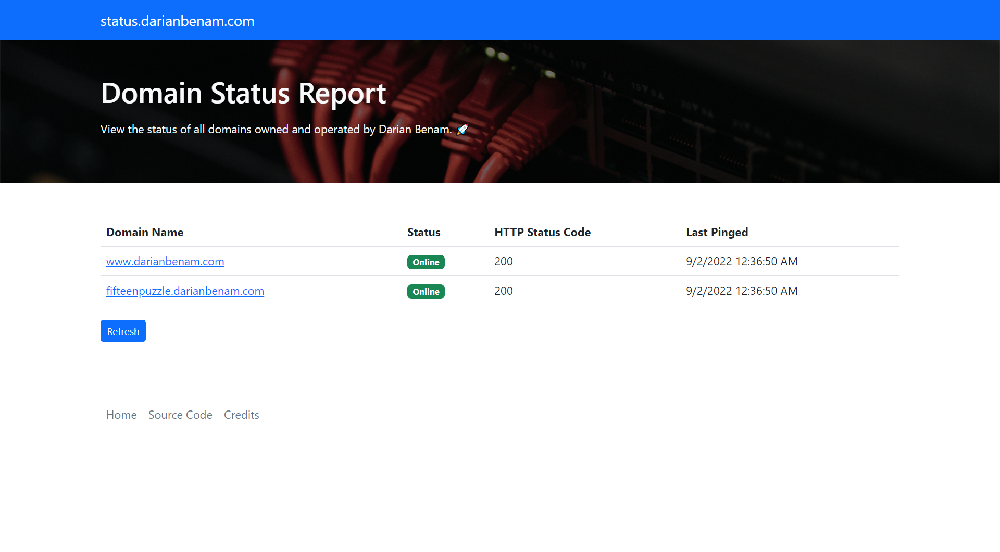

# Domain Status Report


A `.NET 6` [Blazor](https://dotnet.microsoft.com/en-us/apps/aspnet/web-apps/blazor) app that allows users to view the status of all domains owned and operated by Darian Benam. 🚀 This app was built using Visual Studio Community 2022.

## How to Run

### .NET SDK

Assuming the [.NET SDK](https://dotnet.microsoft.com/en-us/download/visual-studio-sdks) is installed, run the following command in the root directory of the project:

```console
dotnet run
```

You can also run the project via an IDE (such as Visual Studio or Visual Studio Code).

### Docker

Assuming [Docker](https://www.docker.com) is installed, run the following command in the root directory of the project:

```console
docker-compose up -d
```

## Live Demo

To view a live demo of this app, visit https://status.darianbenam.com/. The app is deployed on an [NGINX](https://www.nginx.com/) instance running on Ubuntu 22.04 LTS (Jammy Jellyfish).

## Screenshots



